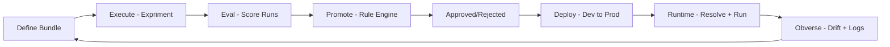
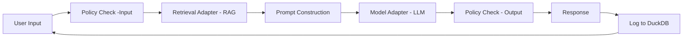
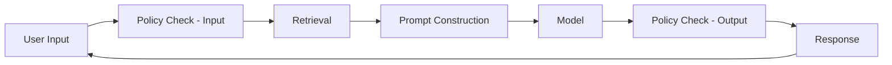

# AI Workbench Control Plane
### Deep Technical Architecture

---

# Core Principle

Bundle = model + prompt + retrieval + policy + evaluation
- Deployable unit is NOT the model
- Full configuration is versioned + governed

Lifecycle management = register + excute + evaluation + promote + deploy + observe (compare w/ challenger)


---

# End-to-End Architecture

```
Users → Control Plane → Runtime
              ↓
        Storage / Evidence
```

---

# Detailed Architecture

```
Users (CLI / Notebook / UI)
            │
            ▼
AI Workbench Control Plane
- Bundle Manager
- Experiment Runner
- Evaluation Engine
- Promotion Engine
- Deployment State Manager
            │
      ┌─────┴─────┐
      ▼           ▼
Storage        Runtime
(JSON + DB)    (Execution)
```

---

# RAG + Policy Runtime Flow



---

# Runtime Resolver

```
env → deployments.json → bundle_id
        │
        ▼
Resolved Bundle Snapshot
        │
        ▼
Adapters (model + retrieval + policy)
```

- Runtime NEVER accepts bundle input
- Always resolves from registry

---

# Bundle Lifecycle

```
draft → evaluated → candidate → approved → deployed
```

- No skipping evaluation
- No direct deployment

---

# Lifecycle Flow

```
Define → Execute → Evaluate → Promote → Deploy → Runtime → Observe
```

---

# Experiment Execution

- Load bundle
- Execute against eval set
- Capture:
  - inputs
  - outputs
  - timings

Artifacts:
- config.json
- predictions.jsonl

---

# Evaluation Engine

Metrics:

- correctness
- groundedness
- policy compliance
- latency
- completeness

Outputs:
- metrics.json
- scorecard.md

---

# Promotion Engine

```
metrics + rules + guardrails → decision
```

- must_pass rules
- regression checks
- weighted metrics

---

# Deployment State

```
dev → bundle_v2
prod → bundle_v1
```

- Explicit environment mapping
- No "latest"

---

# Runtime Execution Detail



---

# Evidence Layer

Stored:

- bundle registry
- run artifacts
- metrics
- promotion decisions
- deployment history
- inference logs

---

# Governance Loop

```
Runtime Logs → Sample → Evaluate → Drift Check → Alert
```

- Detect regression
- Compare vs baseline

---

# Champion vs Challenger

Modes:

- Shadow
- Traffic split

Outputs:
- agreement rate
- latency delta
- policy differences

---

# Rollback

```
prod: bundle_v3 → rollback → bundle_v2
```

- Uses deployment history
- Immediate runtime switch

---

# Key Design Principles

1. Promote bundles, not models
2. Evaluation before deployment
3. Environment state is explicit
4. Evidence is persistent
5. Runtime resolves from registry

---

# Final Takeaway

- Control plane governs lifecycle
- Runtime executes approved bundles only
- Full auditability and reproducibility
