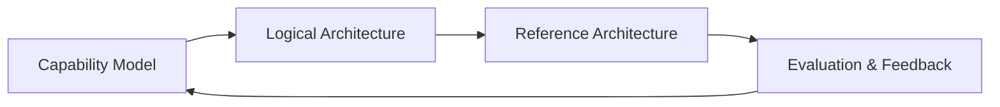
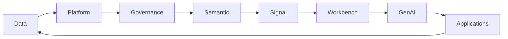
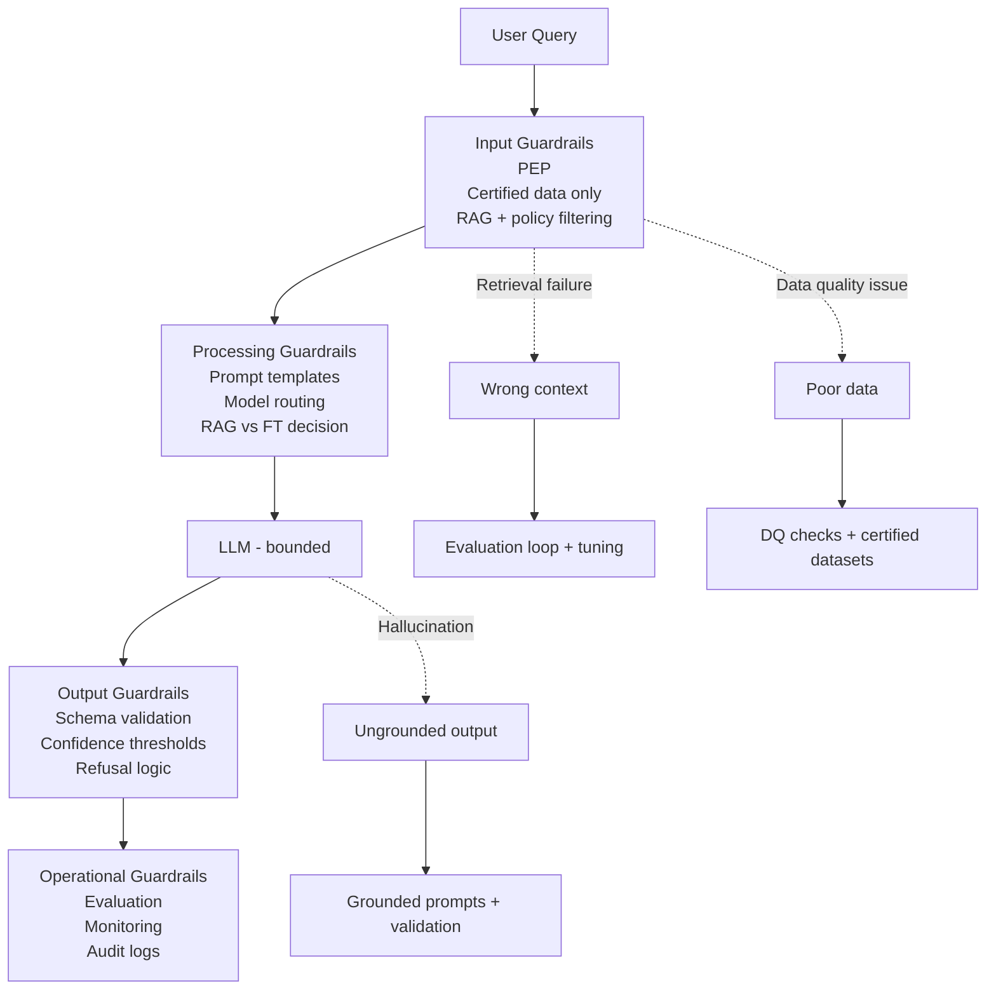

---

# Enterprise AI Loop (Operating Model)

---
<!-- slide: context -->
# 1. Context (Business Domains)

Airlines operate across:
- Customer & Loyalty
- Flight Operations
- Engineering
- Finance

Goal:
👉 Governed enterprise AI

---
<!-- slide: capability_model -->
# 2. Capability Model

### Core_Capabilities_0 (Soul)
-  Recursive Self-Improvement (RSI)

### Core_Capabilities_1 (Data)
- Data pipelines
- Governance
- Semantic layer, Signal layer

---

### Core_Capabilities_2 (AI)

- RAG pipelines
- Prompt management
- Evaluation framework
- Guardrails

👉 AI sits ON governed data

### Core_Capabilities_3 (MLOps)
- AI Bundle Lifecycle Management (AI Workbench Controlplane)
- IaC
- Cost Control

---
<!-- slide: l_rchitecture -->
---

# Logical Architecture (Closed Loop)

---

# 5. Key Principle

- Data ≠ AI, AI must operate on certified, governed data only
- Controls ≠ Models, Control must sit outside the model  
- Retrieval ≠ Generation, Outputs must be validated before consumption 
- Eval is the soul, AI systems must be observable and testable

👉 LLM does NOT reduce risks, Architecture does.

---
<!-- slide: ref_data -->
# 6. Reference Architecture (Data)

- S3 (lake)
- Snowflake (warehouse)
- Kafka (streaming)

---
<!-- slide: ref_governance -->
# 7. Reference Architecture (Governance)

- Data quality rules  
- Lineage tracking, governed regulatory datasets with full lineage
- Policy enforcement  👉 Enforced outside LLM
- AI-assisted validation frameworks

---
<!-- slide: ref_semantic -->
# 8. Semantic Layer

- Certified views only  
- No raw access  

Example:
- vw_customer_360
- vw_operations_summary

---
<!-- slide: ref_rag -->
# 9. RAG Pipeline

1. Query  
2. Retrieve (semantic + KB)  
3. Apply policy  
4. Send to LLM  
5. Generate response  

👉 No raw data exposure

---
<!-- slide: ref_PEP -->
# 10. Control Points

| Layer | Control |
|------|--------|
| Ingestion | Schema validation |
| Semantic | Certified views |
| Retrieval | Policy filtering |
| Output | Guardrails |

---
<!-- slide: zoom_guardrails -->

# Guardrails: End-to-End Control Model

## Principle
👉 Deterministic controls surround probabilistic models  
👉 Policy Enforcement Point (PEP) sits **before the LLM**

---

## Control Flow (Visual)

---
<!-- slide: failure_mode-->
## Failure Mode (Designed for Reality)

| Stage     | Failure            | Mitigation                          |
|----------|------------------|------------------------------------|
| Retrieval | Wrong context     | Evaluation loop + scoring + tuning |
| LLM       | Hallucination     | Grounded prompts + output controls |
| Data      | Poor data quality | DQ checks + certified datasets     |

---
<!-- slide: eval_loop -->
# 12. Evaluation Loop

Generate → Retrieve → Evaluate → Score → Promote

- Weak signals removed  
- Strong signals promoted  

---
<!-- slide: workbench -->
# 13. Workbench

- Experiment signals  
- Compare performance  
- Promote to production  

---
<!-- slide: E2E-flow-->
# 14. End-to-End Flow

Data → Semantic → Signal → Workbench → GenAI → Application

---
<!-- slide: key_takeaway -->
# 15. Key Takeaway

👉 Deterministic controls + probabilistic reasoning  

Result:
- Explainable  
- Governed  
- Scalable AI