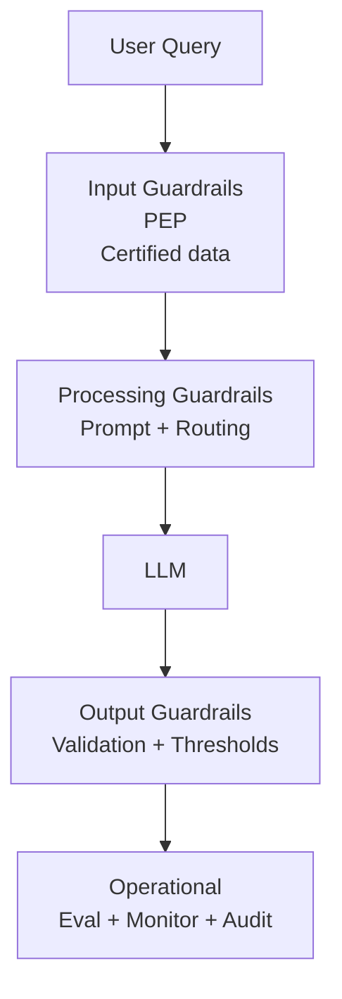

# Airlines Enterprise AI Platform

### Governed AI at Scale

👉 From Data → Insight → Action

---

# The Challenge

Airlines need to scale AI across:
- Customer, Operations, Engineering, Finance

But face risks:
- Uncontrolled data access
- Hallucinations / ungrounded outputs
- Lack of auditability

👉 AI without control = enterprise risk

---

# Architecture Overview

Data → Platform → Governance → Semantic → Signal → Workbench → GenAI → Applications

### Key Idea
👉 AI sits on **governed, certified data**

- Semantic layer = business truth
- Workbench = experimentation
- GenAI = controlled interface

👉 LLM is a component, not the system

---

# Guardrails: Control at Every Stage

- Deterministic controls surround probabilistic models  
- Policy Enforcement Point (PEP) before LLM  

---

# Continuous Evaluation & Improvement

Generate → Retrieve → Evaluate → Score → Promote

- Weak signals removed
- Strong signals promoted
- System improves over time

### Failure Handling

- Wrong context → evaluation loop
- Hallucination → output controls
- Poor data → certified datasets

👉 AI system that learns safely

---

# Business Outcome

This architecture enables:

- Explainable AI
- Governed data access
- Audit-ready decisions
- Scalable AI adoption

---

## Key Takeaway

👉 Deterministic controls + probabilistic reasoning

= Enterprise AI without chaos

